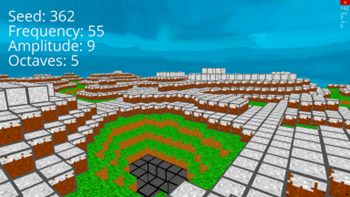
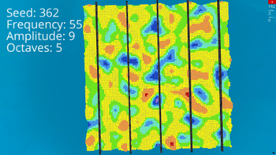

# 🎮 Perlin Noise

*Minecraft‑style terrain experiment to find optimal Perlin noise parameters.*

This repo contains a small interactive app to explore Perlin noise parameters and generate a Minecraft‑like world 🌍. You can move around the world and tweak values to see how the landscape changes in real time. A companion essay documents the research process, methodology, and results.

---

## 🖼️ Demo
**Minecraft-like (ground) view**



**Birds-eye (top) view**



---

## 🌲 Features

* Generat **terrain** in real‑time with Perlin noise
* **Parameter exploration** to create varied landscapes (flat plains, rolling hills, mountains)
* **Textured blocks** by elevation (grass, stone, snow)
* **Data export**: saves heights of five transect lines to `noise.xlsx` for analysis
* Lightweight Python app using **[Ursina](https://www.ursinaengine.org/)** for rendering

---

## 🚀 Getting started

### ⚙ Requirements️

* **Python 3.11+**
* Packages: `ursina`, `xlsxwriter`

### 📥 Install

```bash
# clone
git clone https://github.com/Rdrg-Blnc/Perlin_Noise.git
cd Perlin_Noise

# create a virtual environment (recommended)
python -m venv .venv
# Windows
. .venv/Scripts/activate
# macOS/Linux
source .venv/bin/activate

# install deps
pip install -U pip
pip install ursina xlsxwriter
```

### 🕹️ Run

```bash
python main.py
```

This opens a window with a Minecraft‑like world. You can move around and play with the parameters to generate different terrains.

> **Tip:** If the window does not appear or you get graphics errors, ensure your graphics drivers are up to date and that OpenGL is available for Ursina.

---

## 📜 How it works (modules)

* **`main.py`** – sets up the app and player; continuously checks the terrain height to keep the player aligned when going up/down.
* **`perlin.py`** – defines the parameters for the Perlin noise function.
* **`Perlin_Noise.py`** – contains the Perlin noise algorithm implementation.
* **`terrain.py`** – generates each block in the world, assigns elevation‑based textures (grass, dirt, stone, snow), and writes five height profiles to `noise.xlsx`. You can modify the world type (1 or 2) to toggle between a ground‑level view and a bird’s‑eye (top) view.

---

## 🎛️ Tuning parameters

* **Seed** – sets the random starting state so worlds are reproducible.
* **Octaves** – number of layered noise samples added together; more octaves add finer detail.
* **Frequency** – controls the size of terrain features; higher frequency → smaller, more frequent features (more variation per unit distance).
* **Amplitude** – overall height scale of the terrain; larger amplitude → taller mountains/deeper valleys.

For further insight into these parameters, refer to **Section 4 (p. 5)** of the essay.

All these parameters can be **adjusted** 🔧 in the `perlin.py` file, by changing the variables at the beginning.

For the **baseline** parameter values used in the study, refer to **Section 6 (p. 15)** of the essay.

---

## 🗂️ Repository layout 

```
Perlin_Noise/
├─ assets/                    # Block textures, 3D models, and demo media
│  ├─ Block textures/          # Two sets of textures: 1 = Minecraft‑like (org), 2 = bird’s‑eye visualization
│  ├─ block.obj                # 3D object model for blocks
│  ├─ demo.png                 # Example demo image for ground view
│  ├─ demo_top.png             # Example demo image for top view
│  ├─ textures.png             # Birds-eye view texture
│  ├─ textures org.png         # Original Minecraft‑style textures
├─ Perlin Noise Essay.pdf # 4,000‑word write‑up of methodology, experiment, and results
├─ Perlin_Noise.py        # Perlin noise algorithm
├─ perlin.py              # Noise parameters
├─ terrain.py             # Terrain generation and Excel export
├─ main.py                # App entry point
├─ noise.xlsx             # Output with height lines (created/updated at runtime)
└─ README.md              # You are here
```

---


## 🧱 Block height mapping

The color or texture of each block depends on the height `y` and the selected **world type** in `terrain.py`.

In this Perlin noise implementation, the lowest possible terrain height is **y = 1**. All blocks are generated starting from this level upward, ensuring that no part of the terrain falls below ground level.

### World type 1 (normal terrain view)

* `1 ≤ y < 3` → **Stone**
* `3 ≤ y < 6` → **Grass**
* `6 ≤ y < 9` → **Snowy dirt**
* `y ≥ 9` → **Snow**

### World type 2 (bird’s-eye color view)

* `y = 1` → **Purple**
* `y = 2` → **Ocean blue**
* `y = 3` → **Light blue**
* `y = 4` → **Aqua**
* `y = 5` → **Green**
* `6 ≤ y < 8` → **Yellow**
* `8 ≤ y < 10` → **Orange**
* `y ≥ 10` → **Red**
* `y = amplitude + 2` → **Black line marker**

---

## 📊 Exported data

When you run the app, the script saves the heights of **five** data lines into `noise.xlsx` using `xlsxwriter`. You can open this file in Excel/LibreOffice/Numbers to plot and compare results between parameter settings.

---

## 📚 References

All references are compiled in the essay: see **page 31** of the PDF.

* [Perlin Noise Essay (PDF)](./Perlin%20Noise%20Essay.pdf)

---
